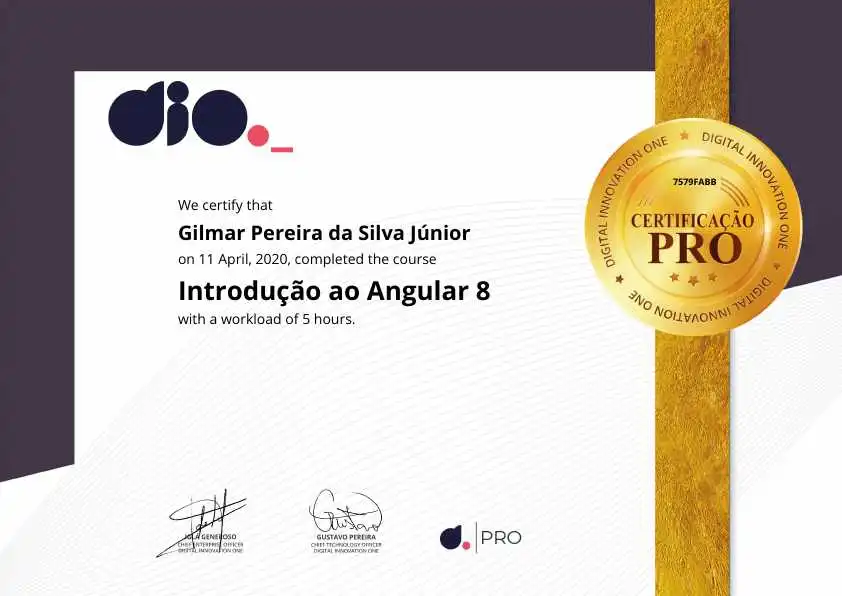
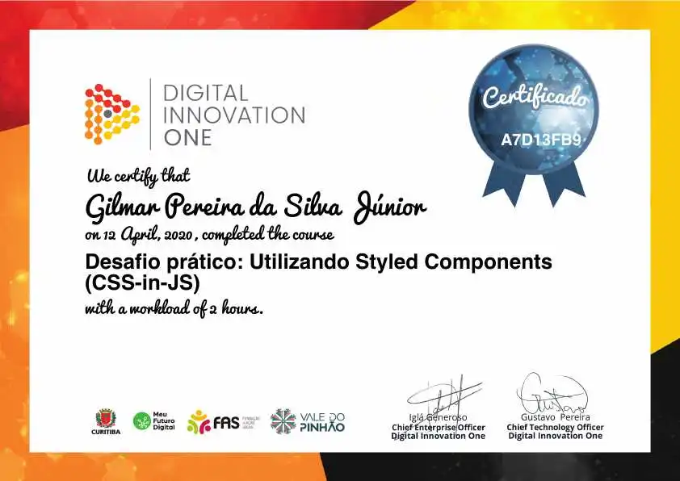
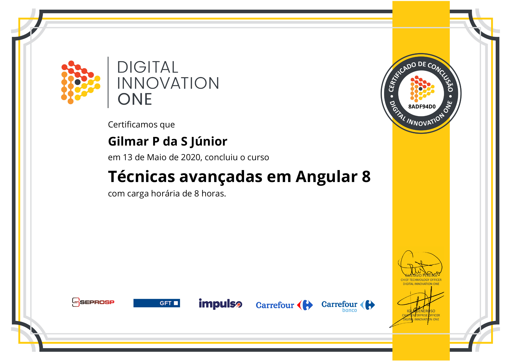
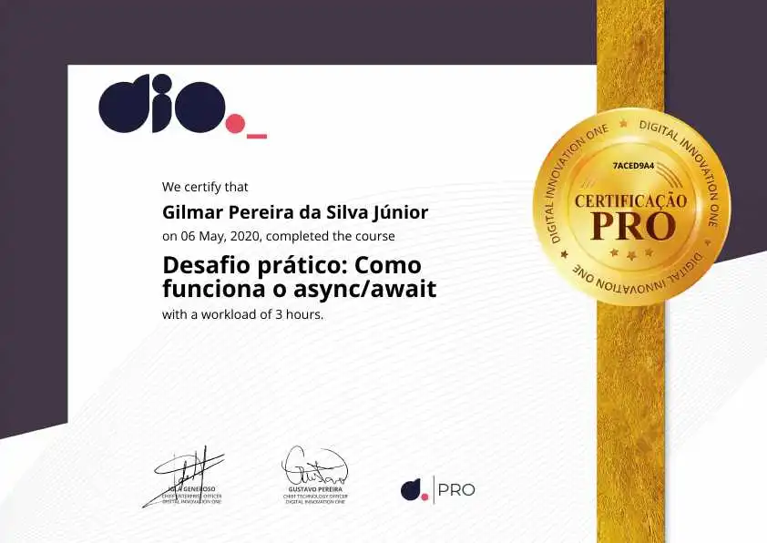
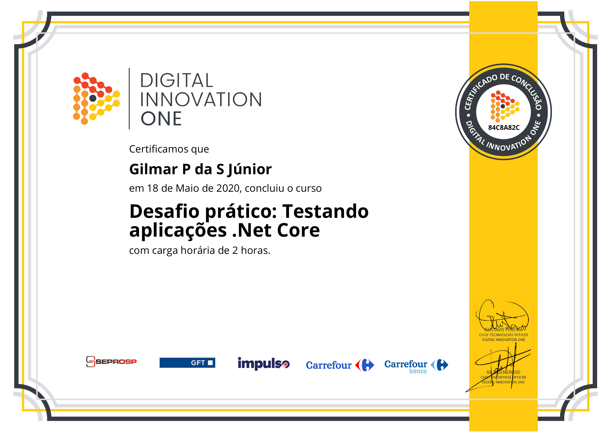
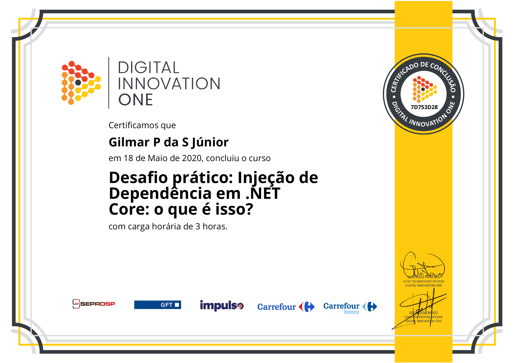
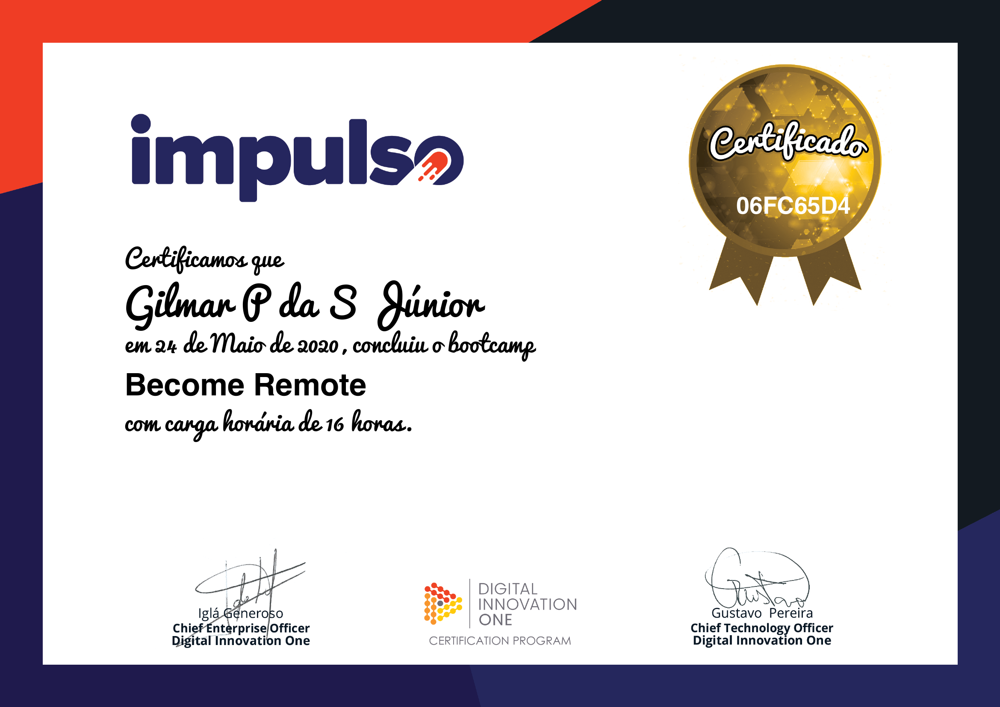
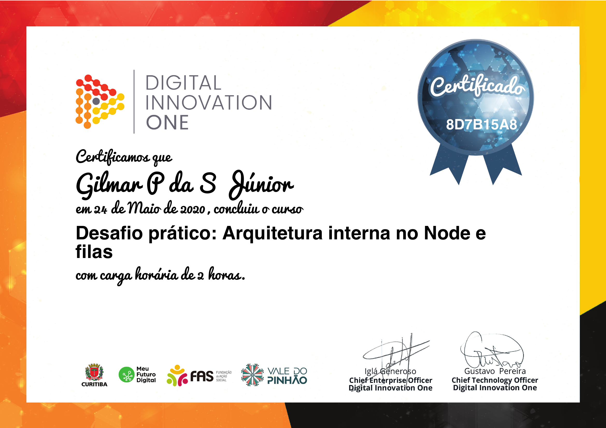

<h2>Hi there 👋</h2>

### Hi 👽, I'm here just to learn about programming and exchange experiences about computing.

- 🔭 I’m currently working on SEEMG. This is not my formation area, but I always deal with IT...
- 🤓 I'm very familiarized with GNU/Linux systems...
- 🌱 I’m currently learning: Javascript, Angular and React...

  
  
  
  
  
  
  
  
  
  
  
  
  
  
  
  
  
  
  
  
  
  
  
  
  
  
  
  
  
  
  
  
  
  
  
  
  
  
  

-----
### My courses

| Course | Diploma |  |
| -------- | -------- | -------- |
| Lógica de Programação Essencial | [Certificado](https://www.dio.me/en/certificate/0A932922/share) |  |
| Introdução ao Git e Controle de Versões | [Certificado](https://www.dio.me/en/certificate/D007D355/share) |  |
| Introdução ao Git e comandos para trabalhar em equipe | [Certificado](https://www.dio.me/en/certificate/58F140E3/share) |  |
| Programação para internet com JavaScript | [Certificado](https://www.dio.me/en/certificate/48A3D686/share) |  |
| Projetos Ágeis com SCRUM | [Certificado](https://www.dio.me/en/certificate/BC5DFC3F/share) |  |
| Desenvolvimento básico em Java | [Certificado](https://www.dio.me/en/certificate/70CE85FA/share) |  |
| Introdução ao framework Spring Boot | [Certificado](https://www.dio.me/en/certificate/4AC1E21F/share) |  |
| Mentalidade Empreendedora | [Certificado](https://www.dio.me/en/certificate/D0CEA850/share) |  |
| Introduçao ao domain driver design e padrões de arquitetura | [Certificado](https://www.dio.me/en/certificate/91109649/share) |  |
| JavaScript ES6 essencial | [Certificado](https://www.dio.me/en/certificate/83DFF87A/share) |  |
| Arquitetura de Sistemas Avançado | [Certificado](https://www.dio.me/en/certificate/76E6B82D/share) |  |
| Fundamentos de Arquitetura de Sistemas | [Certificado](https://www.dio.me/en/certificate/8FDCC28D/share) |  |
| Programação para internet com HTML5 e CSS3 | [Certificado](https://www.dio.me/en/certificate/E5560A0F/share) |  |
| Construindo páginas para internet com Bootstrap | [Certificado](https://www.dio.me/en/certificate/A6375727/share) |  |
| Expert Lesson: Arquitetura Hexagonal: mantendo aplicações saudáveis | [Certificado](https://www.dio.me/en/certificate/E60FB89A/share) |  |
| Fundamentos do Intraempreendedorismo | [Certificado](https://www.dio.me/en/certificate/5E9F229A/share) |  |
| Introdução à biblioteca jQuery | [Certificado](https://www.dio.me/en/certificate/482126EE/share) |  |
| Primeiros passos com .NET | [Certificado](https://www.dio.me/en/certificate/2B97D232/share) |  |
| Desafio prático: Recriando o jogo da cobrinha com JavaScript | [Certificado](https://www.dio.me/en/certificate/155D2BF7/share) |  |
| Desafio prático: Entendo Promises de uma vez por todas | [Certificado](https://www.dio.me/en/certificate/184B8FD7/share) |  |
| Modelagem de Negócios | [Certificado](https://www.dio.me/en/certificate/93BE5667/share) |  |
| Desafio Prático: TDD com JavaScript | [Certificado](https://www.dio.me/en/certificate/4131FF53/share) |  |
| Liderança de Negócios com Cultura Ágil | [Certificado](https://www.dio.me/en/certificate/9A2CFDD4/share) |  |
| Criação de Soluções Inovadoras | [Certificado](https://www.dio.me/en/certificate/CA9C2341/share) |  |
| Estratégia de Negócios com OKR | [Certificado](https://www.dio.me/en/certificate/CF69F37D/share) |  |
| Estratégias para Captação de Investimentos | [Certificado](https://www.dio.me/en/certificate/72EB6F04/share) |  |
| Fundamentos para a Criação de Produtos Digitais | [Certificado](https://www.dio.me/en/certificate/725BB2EC/share) |  |
| Fundamentos de Negócios Digitais Escaláveis | [Certificado](https://www.dio.me/en/certificate/13C37921/share) |  |
| Desafio Prático: Performance Web Utilizando JavaScript | [Certificado](https://www.dio.me/en/certificate/42F92EBE/share) |  |
| Inovação Aberta e Ecossistema de Inovação | [Certificado](https://www.dio.me/en/certificate/22439D8B/share) |  |
| Especialista em Inovação Digital | [Certificado](https://www.dio.me/en/certificate/20076AED/share) |  |
| Desafio prático: Criando uma home com Styled Components | [Certificado](https://www.dio.me/en/certificate/959F9129/share) |  |
| Desafio prático: Criando uma API em Node.js para gerenciar seus crushes | [Certificado](https://www.dio.me/en/certificate/60058B77/share) |  |
| Introdução ao ReactJS | [Certificado](https://www.dio.me/en/certificate/9AE3EF1B/share) |  |
| JavaScript ES6 essencial | [Certificado](https://www.dio.me/en/certificate/7579FABB/share) |  |
| Desafio prático: Utilizando Styled Components (CSS-in-JS) | [Certificado](https://www.dio.me/en/certificate/A7D13FB9/share) |  |
| Desafio prático: Praticando JavaScript com React | [Certificado](https://www.dio.me/en/certificate/8B91E4A1/share) |  |
| Desafio prático: React.js com TypeScript | [Certificado](https://www.dio.me/en/certificate/072BEF5F/share) |  |
| Desenvolvimento de aplicações para internet com ReactJS | [Certificado](https://www.dio.me/en/certificate/95375BE5/share) |  |
| Introdução ao Node.js com Express | [Certificado](https://www.dio.me/en/certificate/474F93DE/share) |  |
| Conceitos e Melhores Práticas com Bancos de Dados PostgreSQL | [Certificado](https://www.dio.me/en/certificate/CE822F1B/share) |  |
| Desenvolvimento back-end com Node.js | [Certificado](https://www.dio.me/en/certificate/EA5AB2EF/share) |  |
| Desenvolvimento avançado com JavaScript ES6 | [Certificado](https://www.dio.me/en/certificate/61407549/share) |  |
| Desenvolvimento de aplicações com .NET | [Certificado](https://www.dio.me/en/certificate/1143FBE9/share) |  |
| Criando aplicações web com Spring Web MVC | [Certificado](https://www.dio.me/en/certificate/19031D1E/share) |  |
| Desafio prático: Desmistificando map, filter e reduce | [Certificado](https://www.dio.me/en/certificate/CDADC850/share) |  |
| Técnicas avançadas em Angular 8 | [Certificado](https://www.dio.me/en/certificate/8ADF94D0/share) |  |
| Desafio prático: Como gerenciar o estado das aplicações em Redux | [Certificado](https://www.dio.me/en/certificate/9A2CFDD4/share) |  |
| Como funciona o async/await | [Certificado](https://www.dio.me/en/certificate/7ACED9A4/share) |  |
| Criando um repositório para seus projetos inovadores | [Certificado](https://www.dio.me/en/certificate/01683F58/share) |  |
| Testando aplicações .NET Core | [Certificado](https://www.dio.me/en/certificate/84C8A82C/share) |  |
| Desafio prático: Injeção de Dependência em .NET Core: o que é isso? | [Certificado](https://www.dio.me/en/certificate/7D753D28/share) |  |
| Introdução ao PHP | [Certificado](https://www.dio.me/en/certificate/B9F6823E/share) |  |
| Desmistificando o trabalho remoto | [Certificado](https://www.dio.me/en/certificate/0DAF2C51/share) |  |
| Como se comunicar de forma eficiente e eficaz trabalhando remotamente | [Certificado](https://www.dio.me/en/certificate/6EA83126/share) |  |
| Como gerenciar seus projetos trabalhando remotamente | [Certificado](https://www.dio.me/en/certificate/D36EA2F3/share) |  |
| Desmistificando o trabalho remoto | [Certificado](https://www.dio.me/en/certificate/0DAF2C51/share) |  |
| Rotina e produtividade individual no trabalho remoto | [Certificado](https://www.dio.me/en/certificate/D36EA2F3/share) |  |
| Become Remote | [Certificado](https://www.dio.me/en/certificate/06FC65D4/share) |  |
| Introdução à LGPD | [Certificado](https://www.dio.me/en/certificate/4B12E2C8/share) |  |
| Desafio prático: Arquitetura interna no Node e filas | [Certificado](https://www.dio.me/en/certificate/8D7B15A8/share) |  |

| 54 | Desmistificando o trabalho remoto | [Certificado](https://www.dio.me/en/certificate/0DAF2C51/share) |  |
| 54 | Desmistificando o trabalho remoto | [Certificado](https://www.dio.me/en/certificate/0DAF2C51/share) |  |
| 54 | Desmistificando o trabalho remoto | [Certificado](https://www.dio.me/en/certificate/0DAF2C51/share) |  |
| 54 | Desmistificando o trabalho remoto | [Certificado](https://www.dio.me/en/certificate/0DAF2C51/share) |  |
| 54 | Desmistificando o trabalho remoto | [Certificado](https://www.dio.me/en/certificate/0DAF2C51/share) |  |
| 54 | Desmistificando o trabalho remoto | [Certificado](https://www.dio.me/en/certificate/0DAF2C51/share) |  |
| 54 | Desmistificando o trabalho remoto | [Certificado](https://www.dio.me/en/certificate/0DAF2C51/share) |  |
| 54 | Desmistificando o trabalho remoto | [Certificado](https://www.dio.me/en/certificate/0DAF2C51/share) |  |
| 54 | Desmistificando o trabalho remoto | [Certificado](https://www.dio.me/en/certificate/0DAF2C51/share) |  |
| 54 | Desmistificando o trabalho remoto | [Certificado](https://www.dio.me/en/certificate/0DAF2C51/share) |  |
| 54 | Desmistificando o trabalho remoto | [Certificado](https://www.dio.me/en/certificate/0DAF2C51/share) |  |
| 54 | Desmistificando o trabalho remoto | [Certificado](https://www.dio.me/en/certificate/0DAF2C51/share) |  |
| 54 | Desmistificando o trabalho remoto | [Certificado](https://www.dio.me/en/certificate/0DAF2C51/share) |  |
| 54 | Desmistificando o trabalho remoto | [Certificado](https://www.dio.me/en/certificate/0DAF2C51/share) |  |
| 54 | Desmistificando o trabalho remoto | [Certificado](https://www.dio.me/en/certificate/0DAF2C51/share) |  |
| 54 | Desmistificando o trabalho remoto | [Certificado](https://www.dio.me/en/certificate/0DAF2C51/share) |  |
| 54 | Desmistificando o trabalho remoto | [Certificado](https://www.dio.me/en/certificate/0DAF2C51/share) |  |
| 54 | Desmistificando o trabalho remoto | [Certificado](https://www.dio.me/en/certificate/0DAF2C51/share) |  |
| 54 | Desmistificando o trabalho remoto | [Certificado](https://www.dio.me/en/certificate/0DAF2C51/share) |  |
| 54 | Desmistificando o trabalho remoto | [Certificado](https://www.dio.me/en/certificate/0DAF2C51/share) |  |
| 54 | Desmistificando o trabalho remoto | [Certificado](https://www.dio.me/en/certificate/0DAF2C51/share) |  |
| 54 | Desmistificando o trabalho remoto | [Certificado](https://www.dio.me/en/certificate/0DAF2C51/share) |  |
| 54 | Desmistificando o trabalho remoto | [Certificado](https://www.dio.me/en/certificate/0DAF2C51/share) |  |
| 54 | Desmistificando o trabalho remoto | [Certificado](https://www.dio.me/en/certificate/0DAF2C51/share) |  |
| 54 | Desmistificando o trabalho remoto | [Certificado](https://www.dio.me/en/certificate/0DAF2C51/share) |  |
| 54 | Desmistificando o trabalho remoto | [Certificado](https://www.dio.me/en/certificate/0DAF2C51/share) |  |
| 54 | Desmistificando o trabalho remoto | [Certificado](https://www.dio.me/en/certificate/0DAF2C51/share) |  |
| 54 | Desmistificando o trabalho remoto | [Certificado](https://www.dio.me/en/certificate/0DAF2C51/share) |  |
| 54 | Desmistificando o trabalho remoto | [Certificado](https://www.dio.me/en/certificate/0DAF2C51/share) |  |
| 54 | Desmistificando o trabalho remoto | [Certificado](https://www.dio.me/en/certificate/0DAF2C51/share) |  |
| 54 | Desmistificando o trabalho remoto | [Certificado](https://www.dio.me/en/certificate/0DAF2C51/share) |  |
| 54 | Desmistificando o trabalho remoto | [Certificado](https://www.dio.me/en/certificate/0DAF2C51/share) |  |
| 54 | Desmistificando o trabalho remoto | [Certificado](https://www.dio.me/en/certificate/0DAF2C51/share) |  |
| 54 | Desmistificando o trabalho remoto | [Certificado](https://www.dio.me/en/certificate/0DAF2C51/share) |  |
| 54 | Desmistificando o trabalho remoto | [Certificado](https://www.dio.me/en/certificate/0DAF2C51/share) |  |
| 54 | Desmistificando o trabalho remoto | [Certificado](https://www.dio.me/en/certificate/0DAF2C51/share) |  |
| 54 | Desmistificando o trabalho remoto | [Certificado](https://www.dio.me/en/certificate/0DAF2C51/share) |  |
| 54 | Desmistificando o trabalho remoto | [Certificado](https://www.dio.me/en/certificate/0DAF2C51/share) |  |
| 54 | Desmistificando o trabalho remoto | [Certificado](https://www.dio.me/en/certificate/0DAF2C51/share) |  |
| 54 | Desmistificando o trabalho remoto | [Certificado](https://www.dio.me/en/certificate/0DAF2C51/share) |  |
| 54 | Desmistificando o trabalho remoto | [Certificado](https://www.dio.me/en/certificate/0DAF2C51/share) |  |
| 54 | Desmistificando o trabalho remoto | [Certificado](https://www.dio.me/en/certificate/0DAF2C51/share) |  |
| 54 | Desmistificando o trabalho remoto | [Certificado](https://www.dio.me/en/certificate/0DAF2C51/share) |  |
| 54 | Desmistificando o trabalho remoto | [Certificado](https://www.dio.me/en/certificate/0DAF2C51/share) |  |
| 54 | Desmistificando o trabalho remoto | [Certificado](https://www.dio.me/en/certificate/0DAF2C51/share) |  |
| 54 | Desmistificando o trabalho remoto | [Certificado](https://www.dio.me/en/certificate/0DAF2C51/share) |  |
| 54 | Desmistificando o trabalho remoto | [Certificado](https://www.dio.me/en/certificate/0DAF2C51/share) |  |
| 54 | Desmistificando o trabalho remoto | [Certificado](https://www.dio.me/en/certificate/0DAF2C51/share) |  |
| 54 | Desmistificando o trabalho remoto | [Certificado](https://www.dio.me/en/certificate/0DAF2C51/share) |  |
| 54 | Desmistificando o trabalho remoto | [Certificado](https://www.dio.me/en/certificate/0DAF2C51/share) |  |
| 54 | Desmistificando o trabalho remoto | [Certificado](https://www.dio.me/en/certificate/0DAF2C51/share) |  |
| 54 | Desmistificando o trabalho remoto | [Certificado](https://www.dio.me/en/certificate/0DAF2C51/share) |  |
| 54 | Desmistificando o trabalho remoto | [Certificado](https://www.dio.me/en/certificate/0DAF2C51/share) |  |
| 54 | Desmistificando o trabalho remoto | [Certificado](https://www.dio.me/en/certificate/0DAF2C51/share) |  |
| 54 | Desmistificando o trabalho remoto | [Certificado](https://www.dio.me/en/certificate/0DAF2C51/share) |  |
| 54 | Desmistificando o trabalho remoto | [Certificado](https://www.dio.me/en/certificate/0DAF2C51/share) |  |
| 54 | Desmistificando o trabalho remoto | [Certificado](https://www.dio.me/en/certificate/0DAF2C51/share) |  |
| 54 | Desmistificando o trabalho remoto | [Certificado](https://www.dio.me/en/certificate/0DAF2C51/share) |  |
| 54 | Desmistificando o trabalho remoto | [Certificado](https://www.dio.me/en/certificate/0DAF2C51/share) |  |
| 54 | Desmistificando o trabalho remoto | [Certificado](https://www.dio.me/en/certificate/0DAF2C51/share) |  |
| 54 | Desmistificando o trabalho remoto | [Certificado](https://www.dio.me/en/certificate/0DAF2C51/share) |  |
| 54 | Desmistificando o trabalho remoto | [Certificado](https://www.dio.me/en/certificate/0DAF2C51/share) |  |
| 54 | Desmistificando o trabalho remoto | [Certificado](https://www.dio.me/en/certificate/0DAF2C51/share) |  |
| 54 | Desmistificando o trabalho remoto | [Certificado](https://www.dio.me/en/certificate/0DAF2C51/share) |  |
| 54 | Desmistificando o trabalho remoto | [Certificado](https://www.dio.me/en/certificate/0DAF2C51/share) |  |
| 54 | Desmistificando o trabalho remoto | [Certificado](https://www.dio.me/en/certificate/0DAF2C51/share) |  |
| 54 | Desmistificando o trabalho remoto | [Certificado](https://www.dio.me/en/certificate/0DAF2C51/share) |  |
| 54 | Desmistificando o trabalho remoto | [Certificado](https://www.dio.me/en/certificate/0DAF2C51/share) |  |
| 54 | Desmistificando o trabalho remoto | [Certificado](https://www.dio.me/en/certificate/0DAF2C51/share) |  |
| 54 | Desmistificando o trabalho remoto | [Certificado](https://www.dio.me/en/certificate/0DAF2C51/share) |  |
| 54 | Desmistificando o trabalho remoto | [Certificado](https://www.dio.me/en/certificate/0DAF2C51/share) |  |
| 54 | Desmistificando o trabalho remoto | [Certificado](https://www.dio.me/en/certificate/0DAF2C51/share) |  |
| 54 | Desmistificando o trabalho remoto | [Certificado](https://www.dio.me/en/certificate/0DAF2C51/share) |  |
| 54 | Desmistificando o trabalho remoto | [Certificado](https://www.dio.me/en/certificate/0DAF2C51/share) |  |
| 54 | Desmistificando o trabalho remoto | [Certificado](https://www.dio.me/en/certificate/0DAF2C51/share) |  |
| 54 | Desmistificando o trabalho remoto | [Certificado](https://www.dio.me/en/certificate/0DAF2C51/share) |  |
| 54 | Desmistificando o trabalho remoto | [Certificado](https://www.dio.me/en/certificate/0DAF2C51/share) |  |
| 54 | Desmistificando o trabalho remoto | [Certificado](https://www.dio.me/en/certificate/0DAF2C51/share) |  |
| 54 | Desmistificando o trabalho remoto | [Certificado](https://www.dio.me/en/certificate/0DAF2C51/share) |  |
| 54 | Desmistificando o trabalho remoto | [Certificado](https://www.dio.me/en/certificate/0DAF2C51/share) |  |
| 54 | Desmistificando o trabalho remoto | [Certificado](https://www.dio.me/en/certificate/0DAF2C51/share) |  |
| 54 | Desmistificando o trabalho remoto | [Certificado](https://www.dio.me/en/certificate/0DAF2C51/share) |  |
| 54 | Desmistificando o trabalho remoto | [Certificado](https://www.dio.me/en/certificate/0DAF2C51/share) |  |
| 54 | Desmistificando o trabalho remoto | [Certificado](https://www.dio.me/en/certificate/0DAF2C51/share) |  |
| 54 | Desmistificando o trabalho remoto | [Certificado](https://www.dio.me/en/certificate/0DAF2C51/share) |  |
| 54 | Desmistificando o trabalho remoto | [Certificado](https://www.dio.me/en/certificate/0DAF2C51/share) |  |
| 54 | Desmistificando o trabalho remoto | [Certificado](https://www.dio.me/en/certificate/0DAF2C51/share) |  |
| 54 | Desmistificando o trabalho remoto | [Certificado](https://www.dio.me/en/certificate/0DAF2C51/share) |  |
| 54 | Desmistificando o trabalho remoto | [Certificado](https://www.dio.me/en/certificate/0DAF2C51/share) |  |
| 54 | Desmistificando o trabalho remoto | [Certificado](https://www.dio.me/en/certificate/0DAF2C51/share) |  |
| 54 | Desmistificando o trabalho remoto | [Certificado](https://www.dio.me/en/certificate/0DAF2C51/share) |  |
| 54 | Desmistificando o trabalho remoto | [Certificado](https://www.dio.me/en/certificate/0DAF2C51/share) |  |
| 54 | Desmistificando o trabalho remoto | [Certificado](https://www.dio.me/en/certificate/0DAF2C51/share) |  |
| 54 | Desmistificando o trabalho remoto | [Certificado](https://www.dio.me/en/certificate/0DAF2C51/share) |  |
| 54 | Desmistificando o trabalho remoto | [Certificado](https://www.dio.me/en/certificate/0DAF2C51/share) |  |
| 54 | Desmistificando o trabalho remoto | [Certificado](https://www.dio.me/en/certificate/0DAF2C51/share) |  |
| 54 | Desmistificando o trabalho remoto | [Certificado](https://www.dio.me/en/certificate/0DAF2C51/share) |  |
| 54 | Desmistificando o trabalho remoto | [Certificado](https://www.dio.me/en/certificate/0DAF2C51/share) |  |
| 54 | Desmistificando o trabalho remoto | [Certificado](https://www.dio.me/en/certificate/0DAF2C51/share) |  |
| 54 | Desmistificando o trabalho remoto | [Certificado](https://www.dio.me/en/certificate/0DAF2C51/share) |  |
| 54 | Desmistificando o trabalho remoto | [Certificado](https://www.dio.me/en/certificate/0DAF2C51/share) |  |
| 54 | Desmistificando o trabalho remoto | [Certificado](https://www.dio.me/en/certificate/0DAF2C51/share) |  |
| 54 | Desmistificando o trabalho remoto | [Certificado](https://www.dio.me/en/certificate/0DAF2C51/share) |  |
| 54 | Desmistificando o trabalho remoto | [Certificado](https://www.dio.me/en/certificate/0DAF2C51/share) |  |
| 54 | Desmistificando o trabalho remoto | [Certificado](https://www.dio.me/en/certificate/0DAF2C51/share) |  |
| 54 | Desmistificando o trabalho remoto | [Certificado](https://www.dio.me/en/certificate/0DAF2C51/share) |  |
| 54 | Desmistificando o trabalho remoto | [Certificado](https://www.dio.me/en/certificate/0DAF2C51/share) |  |
| 54 | Desmistificando o trabalho remoto | [Certificado](https://www.dio.me/en/certificate/0DAF2C51/share) |  |
| 54 | Desmistificando o trabalho remoto | [Certificado](https://www.dio.me/en/certificate/0DAF2C51/share) |  |
| 54 | Desmistificando o trabalho remoto | [Certificado](https://www.dio.me/en/certificate/0DAF2C51/share) |  |

- 👯 I’m looking to collaborate on free software projects...
- 🤔 I’m looking for help with my projects too. Good ideas are always welcome...
- 💬 Ask me about anything, but I cannot answer precisely about everything...
- 📫 How to reach me: @juninhsilva14
- ⚡ Fun fact: Somehow I'll always get where I want...
